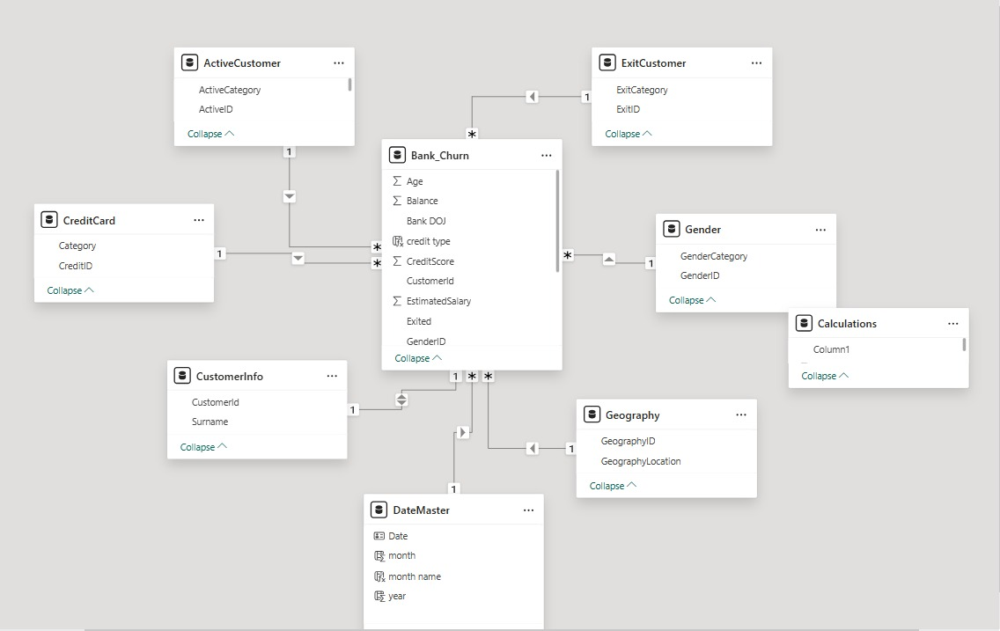
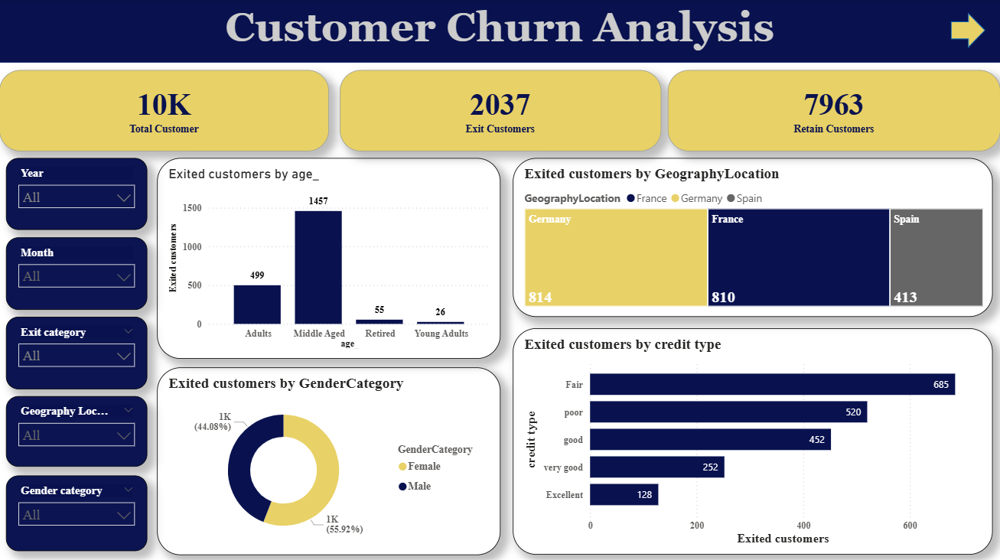
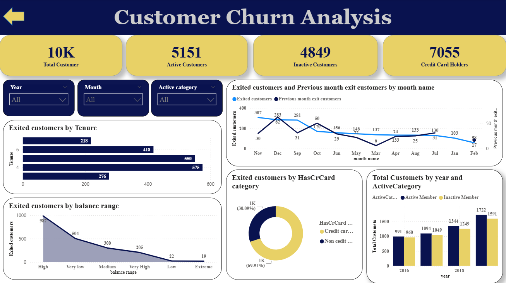

# RBC – Customer Churn Analysis | Power BI Dashboard

## 📌 Project Overview
This project delivers an **end-to-end Customer Churn Analysis dashboard** built in **Power BI** using a structured **business-driven analytics approach**.  
The objective is to identify **key factors influencing customer attrition** and provide actionable insights to support **retention strategies** for a retail banking environment.

The project closely follows real-world analytics workflows, starting from **Business Requirement Documentation (BRD)** through **data modeling, DAX analytics, and executive-ready visualizations**.

---

## 🎯 Business Objective
Customer churn directly impacts revenue and long-term profitability in the banking sector.  
This analysis helps answer critical business questions such as:

- Which customer segments are more likely to exit?
- How do credit score, activity status, geography, and product ownership influence churn?
- Are churn patterns seasonal or time-dependent?
- Which customer profiles should be targeted for retention campaigns?

---

## 📄 Business Requirement Document (BRD)
A formal **BRD** was created at the start of the project to define:
- Business goals and success criteria
- Required KPIs and dimensions
- Data sources and constraints
- Analytical scope and exclusions

The BRD acted as a blueprint, ensuring alignment between business needs and analytical outcomes.

---

## 📂 Data Assets & Sources
The analysis integrates multiple structured datasets representing customer demographics, banking behavior, and churn status:

- `Bank_Churn` (Fact table)
- `ActiveCustomer`
- `ExitCustomer`
- `CreditCard`
- `CustomerInfo`
- `Gender`
- `Geography`
- `DateMaster`

These datasets collectively cover customer lifecycle, product usage, and behavioral attributes.

---

## 🧱 Data Modeling
A **Star Schema** was designed to support high-performance analytics:

### Fact Table
- **Bank_Churn**
  - Age
  - Balance
  - Credit Score
  - Estimated Salary
  - Exit Flag
  - Bank DOJ

### Dimension Tables
- Customer Demographics (Gender, Geography)
- Credit Card Category
- Active / Inactive Status
- Exit Category
- Date Dimension (Year, Month, Month Name)

This modeling approach enables efficient slicing across **time, geography, customer segments, and behavioral attributes**.

---

## 🔄 Data Cleaning & Transformation (Power Query)
Key transformation steps included:
- Handling missing and inconsistent values
- Categorizing credit scores into business-friendly buckets:
  - Excellent, Very Good, Good, Fair, Poor
- Standardizing categorical fields
- Creating derived columns for churn analysis
- Optimizing data types for DAX performance

---

## 📐 DAX Measures & Calculations
Advanced **DAX expressions** were developed to support analytical depth, including:

- Total Customers
- Active vs Inactive Customers
- Exit vs Retained Customers
- Credit Card Holders vs Non-Holders
- Month-over-Month Exit Comparison
- Yearly and Monthly churn trends
- Gender-wise and Geography-wise churn distribution

Time intelligence functions enable **trend analysis and period comparisons**.

---

## 📊 Dashboard & Visualizations
The Power BI dashboard is fully interactive and includes:

### KPI Overview
- Total Customers
- Active Customers
- Inactive Customers
- Exit Customers
- Retained Customers
- Credit Card vs Non-Credit Card Customers

### Churn Analysis Views
- Exit Customers by Credit Score Category
- Exit Customers by Gender
- Exit Customers by age
- Exit Customers by Credit Card Ownership
- Monthly Exit Trends with Previous Month Comparison
- Exit Customers by Tenure
- Exit Customers by Balance
- Year-wise churn analysis (2016–2019)
- Exit Customers by Geography

### Interactive Controls
- Year slicer
- Month slicer
- Geography filter
- Active / Exit category filters

---

---

---

## 🔍 Key Business Insights
- Customers with **lower credit scores** exhibit significantly higher churn
- **Inactive customers** are more likely to exit than active members
- **Credit card holders** show higher churn rates may be due to dissatisfaction in service provided by bank
- Certain geographies demonstrate **consistently higher attrition**
- Churn patterns vary month-over-month, highlighting opportunities for **timely retention campaigns**

---

## 🛠 Tools & Technologies
- **Power BI Desktop**
- **DAX (Data Analysis Expressions)**
- **Power Query**
- **Excel**
- **Dimensional Data Modeling**
- **Business Requirement Documentation (BRD)**

